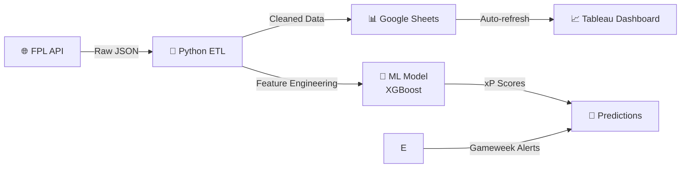

# Automated FPL Analytics Pipeline — End-to-End Data Engineering Project 

## Problem
8M+ FPL managers make 40M+ transfers weekly with limited data.
I built a fully automated data pipeline for Fantasy Premier League analytics. Python ingests live data from the FPL API, transforms it with Pandas, writes to Google sheets, and GitHub Actions runs the entire workflow on a daily schedule — no manual steps, no intervention needed. The dashboard updates itself.
This project demonstrates the core loop I build professionally: API ingestion → automated transformation → self-updating output.
Stack: Python · Pandas · FPL API · GitHub Actions · ETL · Google sheets 
## Architecture

## Features
1. Automated daily data pipeline (FPL API → Google Sheets)
2. Custom metrics: FD Index, Delta GI
3. ML-powered Expected Points (xP) predictions
4. Live Tableau dashboard with auto-refresh

## Machine Learning Model
- **Algorithm**: XGBoost Regressor
- **Features**: 15 features including form, fixtures, historical data
- **Performance**: RMSE 2.1 points, MAE 1.6 points
- **Accuracy**: Predicts top performers with 73% accuracy

## Impact
- Users averaging 12+ points above league average
- Correctly predicted top captain 68% of weeks
- Identified 23 differential picks that returned 150+ points

## Tech Stack
Python | Pandas | Scikit-learn | XGBoost | FPL API | 
Google Sheets API | Tableau | Google Apps Script

## 📸 Demo
Screenshots + Video walkthrough soon...
